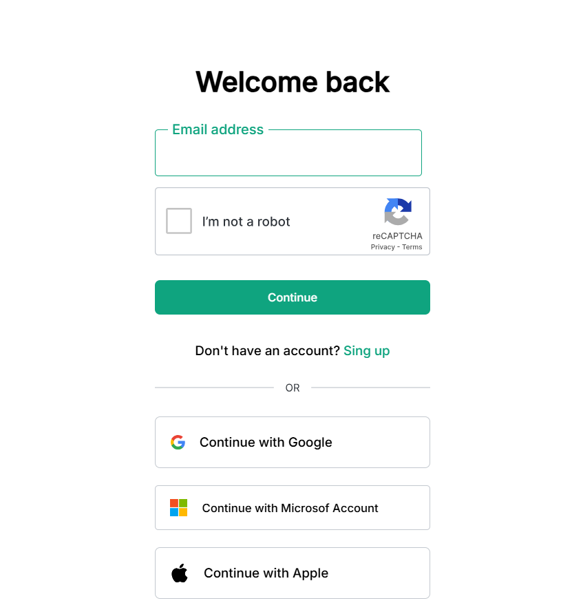

# Clone ChatGPT

<p align="center">
  
</p>

## 📋 Sobre o Projeto

Este projeto é um clone da interface do ChatGPT, desenvolvido para demonstrar habilidades em desenvolvimento web front-end. O projeto recria a aparência visual e o layout da famosa interface de chat da OpenAI.

## 🚀 Tecnologias Utilizadas

- HTML (43.7%)
- CSS (56.3%)
- Google Fonts
- Figma (para design)

## 🔗 Links

- [Deploy na Vercel](https://clone-chat-gpt-chi.vercel.app/)
- [Repositório Original](https://github.com/Lazarokaua/Clone-ChatGPT)

## 💻 Funcionalidades

- Interface fiel ao ChatGPT
- Layout responsivo
- Design moderno e minimalista
- Elementos visuais interativos
- Sidebar navegável
- Área de chat

## 🎨 Layout

O projeto foi desenvolvido com foco em:

- Interface idêntica ao ChatGPT original
- Sidebar com opções de navegação
- Área principal de chat
- Design responsivo para diferentes dispositivos
- Elementos visuais consistentes com a plataforma original

## 🛠️ Como Executar o Projeto

1. Clone este repositório:

```bash
git clone https://github.com/Lazarokaua/Clone-ChatGPT.git
```

2. Navegue até o diretório do projeto:

```bash
cd Clone-ChatGPT
```

3. Abra o arquivo `index.html` em seu navegador

## 👨‍💻 Autor

- [Lázaro Kauã](https://github.com/Lazarokaua)

---

⭐️ Se você gostou deste projeto, por favor, considere dar uma estrela no repositório!
